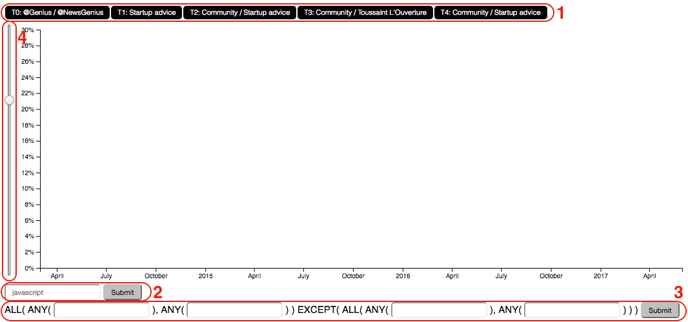
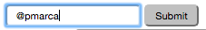
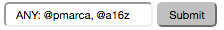
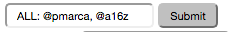
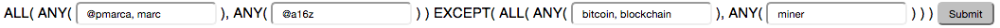

# D3 Trend Exploration Tool
D3 app to explore trends in text data

To demo the tool, click on [this link](http://htmlpreview.github.io/?https://github.com/amolmane1/d3_trend_exploration_tool/blob/master/src/index.html).

This tool makes it easy to view the trends of:
1) Topics (generated using Latent Dirichlet Allocation and manually labelled)
2) Keywords
3) Advanced Combinations of Keywords

I've used [Ben Horowitz's](https://twitter.com/bhorowitz) tweets as my data to visualize. 

Below is a screenshot of the tool. Regions 1,2, and 3 are where you can use the above functionalities:

If you missed it, to demo the tool, click on [this link](http://htmlpreview.github.io/?https://github.com/amolmane1/d3_trend_exploration_tool/blob/master/src/index.html).

How to use the tool:
#### 1) Looking up Topic Trends
Simply click on the button corresponding to the topic for which you want to see the trendline of. Click on it again to hide it. You can view multiple topics together. 

#### 2) Looking up Keyword Trends
- To search for a single keyword, just enter that word in the input box. 

- To search for all posts that contain at least one out of a list of keywords, type `ANY: <word1>, <word2>, <word3>`.

- To search for all posts that contain all words in a list of keywords, type `ALL: <word1>, <word2>, <word3>`.

#### 3) Looking up Advanced Combinations of Keywords
Let's say you wanted to get all posts that talk about code-related things and bug-related things, but don't talk about video-related things and mobile-related things. That's when you use this functionality. This is what you'd enter:

- In the first input field, enter the first list of words (`javascript, script, code`), such that at least one of them needs to be in the target post.
- In the second input field, enter the second list of words (`bug, problem, help, error`), such that at least one of them needs to be in the target post.
- In the third input field, enter the first list of words (`video`), such that if a post contains at least one of them, it won't be counted in the result.
- In the fourth input field, enter the second list of words (`mobile, phone`), such that if a post contains at least one of them, it won't be counted in the result.

You don't **have** to fill up all the input boxes. For example, if I want to find posts about problems with browsers other than google chrome, I can enter this:

If I want to find all posts that talk about forms and buttons, I'd enter this:

For functionalities 2 and 3, you can enter as many words as you want. At the moment, the tool can only look for words that are in the vocabulary of the LDA model. After hitting submit, a button containing the text of the query will appear below the search bars. You can click on that button to toggle the display of the trendline.

#### 4) Adjusting the scale of the Y-axis
Some trend values will be too small (and too close to the x-axis) to see clearly. This input slider lets you change the scale of the y-axis so that you can look at your trendlines more closely. Slide the knob up to decrease the scale, and down to increase the scale. You'll get a better idea of how it works by playing with it.
